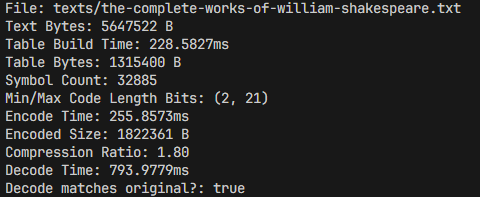

# Huffman Compressor

A Huffman compressor/decompressor. A toy project to learn about all sorts a stuff:

- Huffman comp/decomp, obviously
- Recursive structs (and dropping them!)
- Creating traits
- And, I dunno... other stuff too!

See `main.rs` for a round-trip compression-decompression with stats:

